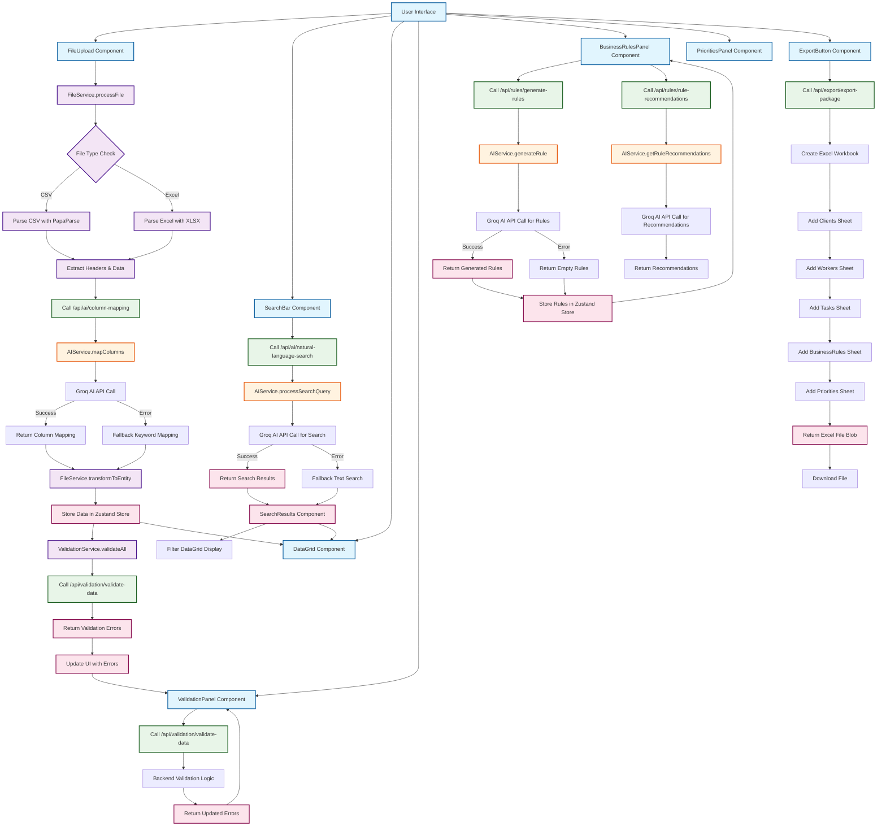

# AI Resource Allocation Configurator

A Next.js application that uses AI to help configure and manage resource allocation systems. The application leverages Groq Cloud API for intelligent data processing, column mapping, natural language search, and business rule generation.

## Features

- **AI-Powered Column Mapping**: Automatically maps CSV/Excel headers to standardized field names
- **Natural Language Search**: Search through clients, workers, and tasks using natural language queries
- **Data Validation & Corrections**: AI-assisted data validation and automatic correction suggestions
- **Business Rule Generation**: Convert natural language descriptions into business rules
- **Rule Recommendations**: Get AI-powered suggestions for business rules based on data patterns
- **Data Export**: Export configured data and rules as packages

## Tech Stack

- **Frontend**: Next.js 14, React 18, TypeScript
- **UI Components**: Radix UI, Tailwind CSS
- **AI Integration**: Groq Cloud API
- **Data Processing**: PapaParse, XLSX
- **State Management**: Zustand
- **Data Tables**: TanStack Table

## Setup

### Prerequisites

- Node.js 18+ 
- npm or yarn
- Groq Cloud API key

### Installation

1. Clone the repository:
```bash
git clone <repository-url>
cd AI_Resource_Allocation_Configurator
```

2. Install dependencies:
```bash
npm install
```

3. Set up environment variables:
Create a `.env.local` file in the root directory:
```env
GROQ_API_KEY=your_groq_api_key_here
```

### Getting a Groq Cloud API Key

1. Go to [Groq Cloud](https://console.groq.com/)
2. Create an account or sign in
3. Navigate to the API Keys section
4. Create a new API key
5. Copy the key to your `.env.local` file

**Note**: Groq Cloud offers fast inference with models like Llama 3. The application uses the `llama3-8b-8192` model by default.

### Running the Application

1. Start the development server:
```bash
npm run dev
```

2. Open [http://localhost:3000](http://localhost:3000) in your browser

## Usage

### 1. Upload Data
- Upload CSV or Excel files containing client, worker, and task data
- The AI will automatically map column headers to standardized field names

### 2. Validate Data
- Review and validate the uploaded data
- Get AI-powered suggestions for data corrections

### 3. Configure Business Rules
- Use natural language to describe business rules
- Get AI-generated rule recommendations based on your data

### 4. Search and Filter
- Use natural language to search through your data
- Filter by various criteria using AI-powered search

### 5. Export Configuration
- Export your complete configuration as a package
- Includes all data, rules, and settings

## Application Workflow

The following flowchart illustrates the complete workflow between major components and services:



### Component Interactions Summary

1. **File Upload Process**:
   - User uploads CSV/Excel → File parsed → AI maps columns → Data transformed → Validation runs → UI updates

2. **Search Process**:
   - User enters query → AI processes natural language → Results filtered → DataGrid highlights matches

3. **Rules Management**:
   - User describes rules → AI generates business rules → Rules stored and displayed

4. **Validation Process**:
   - Data changes trigger validation → Cross-entity checks performed → Errors displayed with suggestions

5. **Export Process**:
   - User clicks export → All data compiled → Excel package generated → File downloaded

### Key Integration Points

- **Zustand Store**: Central state management for all data, errors, rules, and UI state
- **AI Service**: Handles all Groq API interactions with fallback mechanisms
- **Validation Service**: Ensures data integrity across clients, workers, and tasks
- **File Service**: Processes uploads and coordinates with AI for intelligent mapping

## API Endpoints

### AI Services
- `POST /api/ai/column-mapping` - Map CSV headers to standardized fields
- `POST /api/ai/natural-language-search` - Search data using natural language
- `POST /api/ai/data-corrections` - Generate data correction suggestions

### Business Rules
- `POST /api/rules/generate-rules` - Generate business rules from descriptions
- `POST /api/rules/rule-recommendations` - Get AI-powered rule recommendations

### Export
- `POST /api/export/export-package` - Export complete configuration

## Data Schema

### Clients
- `ClientID` (required): Unique identifier
- `ClientName` (required): Client name
- `PriorityLevel` (required): Priority 1-5
- `RequestedTaskIDs`: Array of task IDs (must exist in tasks.csv)
- `GroupTag`: Group classification (must match WorkerGroup in workers.csv)
- `ContactEmail`: Email address
- `ContactPhone`: Phone number
- `Budget`: Budget amount
- `Deadline`: Deadline date

### Workers
- `WorkerID` (required): Unique identifier
- `WorkerName` (required): Worker name
- `Skills`: Array of skills (must cover all RequiredSkills in tasks)
- `WorkerGroup`: Group classification (must match GroupTag in clients.csv)
- `MaxLoadPerPhase`: Maximum load per phase
- `HourlyRate`: Hourly rate
- `Availability`: Array of phase numbers (1-10)
- `Location`: Location

### Tasks
- `TaskID` (required): Unique identifier
- `TaskName` (required): Task name
- `RequiredSkills`: Array of required skills (must exist in worker Skills)
- `EstimatedDuration`: Number of phases
- `Phase`: Current phase
- `PreferredPhases`: Preferred phase numbers (format: "2-4" or "[1,3,5]")
- `Dependencies`: Array of task IDs (must exist in tasks.csv)
- `Priority`: Priority level
- `Cost`: Task cost

## Validation Rules

The application enforces several business rules to ensure data integrity:

1. **Client-Task Validation**: Each RequestedTaskIDs entry must match valid TaskIDs in tasks.csv
2. **Task-Worker Skill Validation**: Every RequiredSkill must appear in at least one worker's Skills
3. **Worker-Phase Validation**: AvailableSlots must contain valid phase numbers (1-10)
4. **Group Tag Validation**: GroupTag in clients must match WorkerGroup in workers
5. **Priority Level Validation**: Client PriorityLevel must be between 1-5
6. **Preferred Phases Validation**: Task PreferredPhases must be in valid format (ranges or lists)
7. **Dependencies Validation**: Task Dependencies must reference existing TaskIDs

## Contributing

1. Fork the repository
2. Create a feature branch
3. Make your changes
4. Add tests if applicable
5. Submit a pull request

## License

This project is licensed under the MIT License.

## Support

For support and questions, please open an issue on GitHub or contact the development team.
